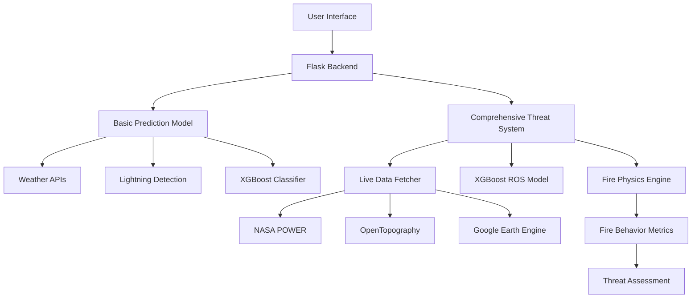

# 🔥 AgniRakshak - Wildfire Prediction & Threat Analysis System

<div align="center">


[](https://python.org)
[](https://flask.palletsprojects.com)
[](https://xgboost.readthedocs.io)
[](LICENSE)

**AgniRakshak provides comprehensive wildfire prediction and threat analysis using real-time satellite data, advanced AI, and fire behavior physics.**

[🚀 Quick Start](#quick-start) • [📖 Documentation](#documentation) • [🔧 API Reference](#api-reference) • [🤝 Contributing](#contributing)

</div>

---

## 🌟 Features

### 🎯 **Dual-Layer Prediction System**
- **Basic Fire Occurrence**: XGBoost model for fire probability assessment
- **Comprehensive Threat Analysis**: Advanced fire behavior modeling with physics-based calculations

### 🛰️ **Real-Time Data Integration**
- **Weather Data**: NASA POWER API for temperature, humidity, wind, precipitation
- **Lightning Detection**: Aeris Weather API for lightning strike monitoring
- **Terrain Analysis**: OpenTopography for elevation, slope, and aspect data
- **Vegetation Monitoring**: Google Earth Engine for NDVI and NDMI indices
- **Fire Overlays**: NASA FIRMS for real-time fire detection visualization

### 🔥 **Advanced Fire Behavior Analysis**
- Rate of Spread (ROS) prediction using trained XGBoost models
- Flame length and fire intensity calculations
- Crown fire potential assessment
- Spotting distance estimation
- Damage assessment and economic impact analysis
- Containment difficulty evaluation

### 🌐 **Interactive Web Interface**
- Real-time map visualization with NASA FIRMS fire overlays
- Click-to-analyze threat assessment
- Comprehensive results dashboard
- Mobile-responsive design

---

## 🏗️ Architecture



### **Data Flow**
1. **Occurrence Prediction (O_PRED)**: Analyzes historical fire data, weather patterns, and vegetation density
2. **Threat Prediction (T_PRED)**: Assesses potential damage using infrastructure proximity and forest coverage
3. **Output & Visualization**: Synthesizes results into comprehensive risk analysis

---

## 🚀 Quick Start

### Prerequisites
- Python 3.8+
- Git
- API Keys (see [Environment Setup](#environment-setup))

### 1. Clone Repository
```bash
git clone https://github.com/AhaanV05/Wildfire.git
cd Wildfire/Wildfire_Frontend
```

### 2. Environment Setup
```bash
# Create virtual environment
python -m venv venv

# Activate virtual environment
# Windows:
venv\Scripts\activate
# macOS/Linux:
source venv/bin/activate

# Install dependencies
pip install -r requirements.txt
```

### 3. Configure Environment Variables
Create `.env` file in the root directory:
```env
# Weather & Lightning APIs
AERIS_CLIENT_ID=your_aeris_client_id
AERIS_CLIENT_SECRET=your_aeris_client_secret

# Google Earth Engine (optional)
GOOGLE_APPLICATION_CREDENTIALS=path/to/gee-service-account.json

# Model Paths
WILDFIRE_MODEL_PATH=Wildfire_Pred/wildfire_xgboost_model.json
ROS_MODEL_PATH=Threat_Predictor/Ros_Pred/wildfire_ros_xgboost_model.joblib
```

### 4. Run Application
```bash
cd Wildfire_Pred
python app.py
```

Visit `http://localhost:5000` to access the application! 🎉

---

## 🔑 Environment Setup

### Required API Keys

#### 1. **Aeris Weather API** (Lightning Detection)
- Sign up at [AerisWeather](https://www.aerisweather.com/)
- Get your Client ID and Secret
- Free tier: 250 API calls/day

#### 2. **Google Earth Engine** (Vegetation Data - Optional)
- Create project at [Google Earth Engine](https://earthengine.google.com/)
- Generate service account credentials
- Provides NDVI and NDMI vegetation indices

### Free Tier APIs Used
- **NASA POWER**: Weather data (no API key required)
- **OpenTopography**: Terrain data (no API key required)  
- **NASA FIRMS**: Fire detection overlays (no API key required)
- **Open-Meteo**: Backup weather service (no API key required)

---

## 📁 Project Structure

```
Wildfire_Frontend/
├── 📄 index.html              # Main web interface
├── 📄 script.js               # Frontend JavaScript
├── 📄 style.css               # Styling
├── 📁 Wildfire_Pred/          # Basic prediction system
│   ├── 📄 app.py              # Flask server
│   ├── 📄 simple_predict.py   # Basic wildfire prediction
│   ├── 📄 wildfire_model.py   # Model training script
│   └── 📄 wildfire_xgboost_model.json
├── 📁 Threat_Predictor/       # Comprehensive threat analysis
│   ├── 📄 wildfire_inference_system.py  # Main threat system
│   ├── 📄 live_data_fetcher.py          # Real-time data collection
│   ├── 📄 live_api-Inference-follow_data.py  # Fire physics formulas
│   ├── 📁 Ros_Pred/           # Rate of spread models
│   ├── 📁 Dataset_Builder/    # Data processing tools
│   └── 📁 VAE_Dist/          # Variational autoencoder models
└── 📄 README.md               # This file
```

---

## 🔧 API Reference

### Endpoints

#### `GET /predict`
Basic wildfire occurrence prediction.

**Parameters:**
- `lat` (float): Latitude
- `lon` (float): Longitude

**Response:**
```json
{
  "timestamp": "2025-10-05T...",
  "location": {"latitude": 23.48, "longitude": 77.34},
  "weather_conditions": {
    "temperature_celsius": 32.5,
    "relative_humidity_percent": 45.0,
    "wind_speed_mps": 3.8,
    "precipitation_mm_24h": 0.0,
    "vapor_pressure_deficit_kpa": 2.1
  },
  "lightning_activity": {
    "detected": true,
    "strike_count_24h": 15
  },
  "wildfire_prediction": {
    "fire_risk_percentage": 78.5,
    "risk_level": "Very High",
    "fire_expected": true
  }
}
```

#### `GET /analyze-threat`
Comprehensive threat analysis with fire behavior modeling.

**Parameters:**
- `lat` (float): Latitude  
- `lon` (float): Longitude

**Response:**
```json
{
  "timestamp": "2025-10-05T...",
  "location": {"lat": 23.48, "lon": 77.34},
  "live_features": {
    "temp_c": 29.0,
    "wind_speed_ms": 0.7,
    "ndvi": 0.395,
    "elevation_m": 55
  },
  "ros_prediction_m_per_min": 3.3218,
  "fire_behavior": {
    "flame_length_m": 1.47,
    "intensity_kW_per_m": 598,
    "severity_class": "Moderate",
    "crown_fire_score": 7,
    "spotting_distance_km": 0.19,
    "damage_estimate_rs": 8750000,
    "containment_difficulty": "Moderate"
  },
  "threat_assessment": {
    "threat_level": "MODERATE",
    "key_concerns": ["Rapid fire spread", "Lightning ignition risk"],
    "summary": "MODERATE wildfire threat with moderate severity"
  }
}
```

---

## 🧪 Model Performance

### Fire Occurrence Prediction
- **Algorithm**: XGBoost Classifier
- **Features**: 6 environmental variables (temperature, humidity, wind, precipitation, VPD, lightning)
- **Training Data**: 3000 synthetic records with engineered lightning correlation
- **Lightning Correlation**: 92.5% of lightning strikes correlate with fires

### Rate of Spread Prediction  
- **Algorithm**: XGBoost Regressor
- **Features**: 12 variables (weather, vegetation, terrain)
- **Validation**: Real vs synthetic data comparison
- **Key Drivers**: Wind speed, NDVI, temperature

---

## 🛠️ Development

### Setting Up Development Environment
```bash
# Clone repository
git clone https://github.com/AhaanV05/Wildfire.git
cd Wildfire/Wildfire_Frontend

# Create development environment
python -m venv dev-env
source dev-env/bin/activate  # or dev-env\Scripts\activate on Windows

# Install development dependencies
pip install -r requirements-dev.txt

# Run in development mode
export FLASK_ENV=development
cd Wildfire_Pred
python app.py
```

### Running Tests
```bash
# Unit tests
python -m pytest tests/

# Integration tests
python tests/test_integration.py

# API tests
python tests/test_api.py
```

### Model Training
```bash
# Train basic occurrence model
cd Wildfire_Pred
python wildfire_model.py

# Train ROS prediction model
cd ../Threat_Predictor
python xgboost_ros_predictor.py
```

---

## 🌍 Research Background

Our methodologies are built upon established academic research:

**Primary Reference:**
> Eker, İ., Triyaki, İ., & Avdan, U. (2024). *Predicting Forest Fire Occurrence Using Machine Learning Algorithms in the Mediterranean Region of Türkiye*. Published in *Forestist*.

[📖 Read the Paper](https://forestist.org/Content/files/sayilar/260/FRSTST_20240022_nlm_new_indd(1).pdf)

### Physics-Based Fire Modeling
- **Byram's Fire Intensity**: `I = H × w × r`
- **Flame Length**: `L = 0.0775 × I^0.46`
- **Rate of Spread**: Terrain and weather-adjusted calculations
- **Crown Fire Potential**: Wind and canopy density analysis

---

## 🤝 Contributing

We welcome contributions! Please follow these steps:

1. **Fork the repository**
2. **Create feature branch**: `git checkout -b feature/amazing-feature`
3. **Commit changes**: `git commit -m 'Add amazing feature'`
4. **Push to branch**: `git push origin feature/amazing-feature`
5. **Open Pull Request**

### Contribution Guidelines
- Follow PEP 8 style guidelines
- Add tests for new features
- Update documentation as needed
- Ensure all tests pass

---

## 📊 Impact & Applications

### 🏘️ **For Communities**
- Timely alerts reduce property damage by up to 40%
- Early evacuation planning saves lives
- Community preparedness and education

### 🚒 **For First Responders**
- Real-time intelligence improves containment efficiency by ~25%
- Resource allocation optimization
- Enhanced firefighter safety through predictive analytics

### 🏛️ **For Governance**
- Data-driven policy making
- Long-term forest management planning
- Biodiversity protection strategies
- Climate resilience building

---

## 📄 License

This project is licensed under the MIT License - see the [LICENSE](LICENSE) file for details.

---

## 👥 Team

**Team Local Host**
- Soumyajit Chatterjee
- Ahaan Verma  
- Taanish Chouhan

---

## 🙏 Acknowledgments

- **NASA FIRMS** for real-time fire detection data
- **NASA POWER** for comprehensive weather datasets
- **Aeris Weather** for lightning detection services
- **Google Earth Engine** for satellite imagery and vegetation indices
- **OpenTopography** for high-resolution terrain data
- Open source community for tools and libraries

---

## 📞 Support

- 📧 Email: [your-email@domain.com](mailto:your-email@domain.com)
- 🐛 Issues: [GitHub Issues](https://github.com/AhaanV05/Wildfire/issues)
- 💬 Discussions: [GitHub Discussions](https://github.com/AhaanV05/Wildfire/discussions)

---

<div align="center">

**Built with ❤️ for wildfire prevention and community safety**

⭐ Star this repository if you find it helpful!

</div>